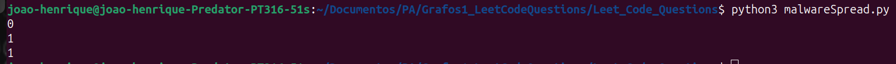
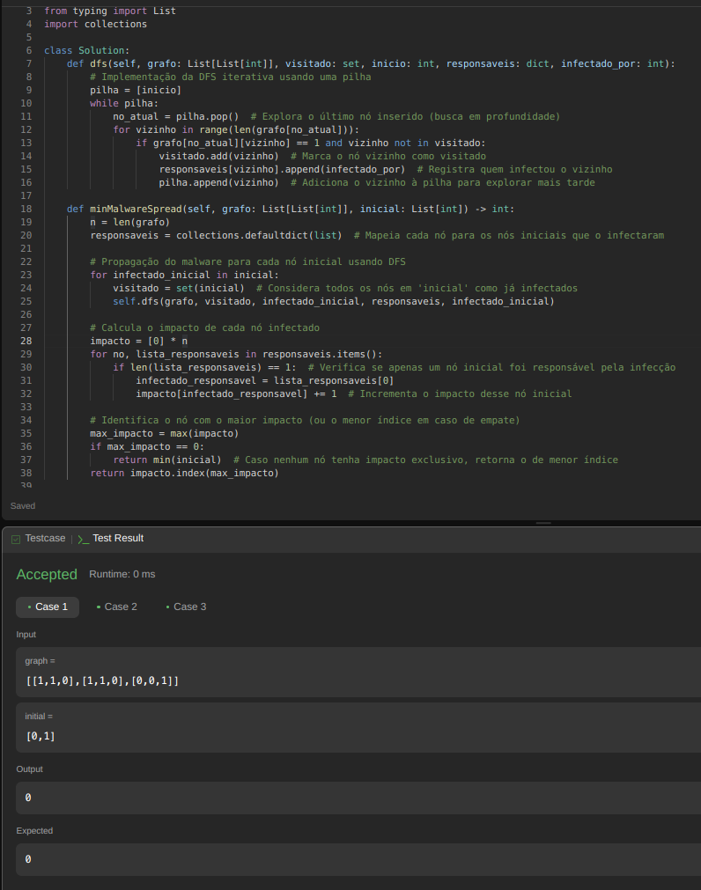
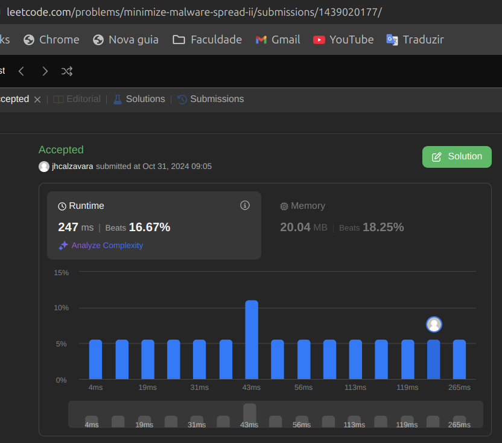
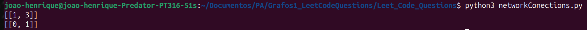
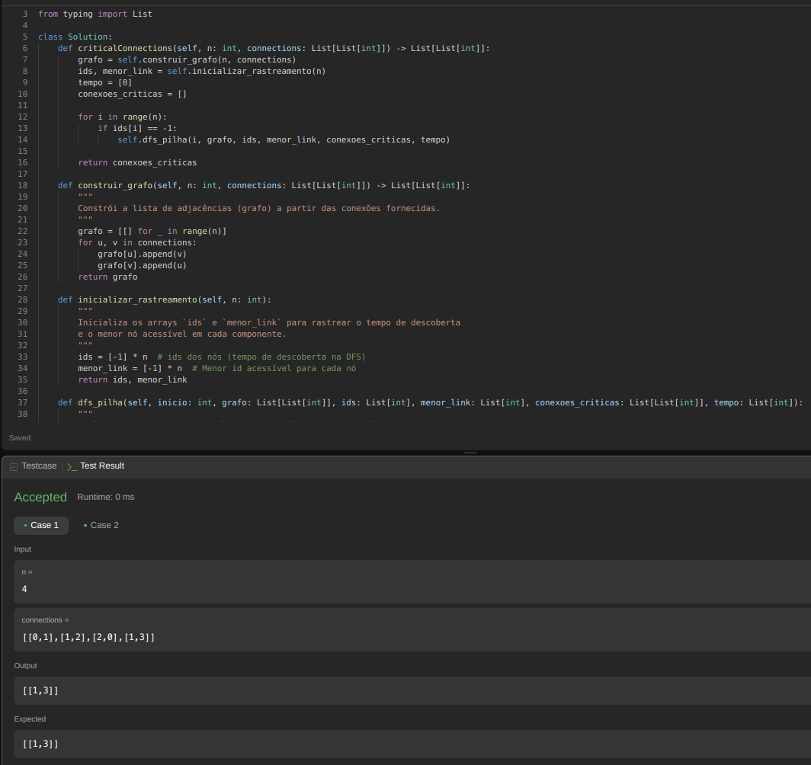
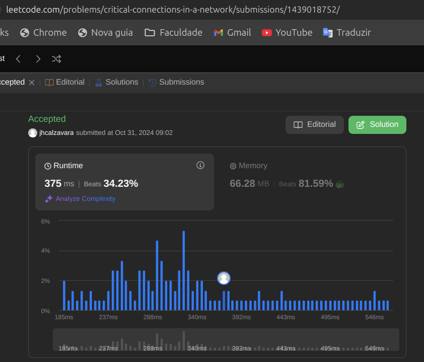

<!-- **!! Atenção: Renomeie o seu repositório para (Tema)_(NomeDoProjeto). !!** 

Temas:
 - Grafos1
 - Grafos2
 - PD
 - D&C
 - Greed
 - Final 
 
 **!! *Não coloque os nomes dos alunos no título do repositório*. Exemplo de título correto: Grafos2_Labirinto-do-Minotauro !!**
 
 (Apague essa seção) -->

# Leet Code Questions

**Número da Lista**: 7<br>
**Conteúdo da Disciplina**: Grafos 1<br>

## Alunos
|Matrícula | Aluno |
| -- | -- |
| 19/0085819  |  Cicero Barrozo Fernandes Filho |
| 20/0067923  |  João Henrique Marques Calzavara |

## Sobre 
&emsp;&emsp;Esse projeto visa desenvolver questões sobre o conteúdo ministrado de Grafos 1, com foco nos algoritmos BFS (Breadth-First Seach) que faz a busca em largura em grafos, e o algoritmo DFS (Depth-First Search) que faz a busca em profundidade nos grafos.Para isso, serão feitas questões de média ou alta dificuldade da plataforma de juíz online, ***Leet Code*** que nos fornece uma alta quantidade de questões desses temas a serem feitas.

## Questões

|Questão | Dificuldade | Código presente em:|
| -- | -- | -- |
| [1192. Critical connections in a network](https://leetcode.com/problems/critical-connections-in-a-network/description/)  |  ***Difícil*** | [networkConections.py](Leet_Code_Questions/networkConections.py) |
|  [928. Minimize malware spread ii](https://leetcode.com/problems/minimize-malware-spread-ii/description/) |  ***Difícil*** | [malwareSpread.py](Leet_Code_Questions/malwareSpread.py)|

## Screenshots
<!-- Adicione 3 ou mais screenshots do projeto em funcionamento. -->
### malwareSpread.py
- Rodando o arquivo python no terminal na pasta onde ele se encontra, após descomentar os testes no final do arquivo:
    - 
- Rodando o arquivo no ***Leet Code*** com seus testes passando:
    - 
- Submissão aceita no ***Leet code***:
    - 
<br>


### networkConections.py
- Rodando o arquivo python no terminal na pasta onde ele se encontra, após descomentar os testes no final do arquivo:
    - 
- Rodando o arquivo no ***Leet Code*** com seus testes passando:
    - 
- Submissão aceita no ***Leet code***:
    - 


## Instalação
**Linguagem**: Python<br>
<!-- **Framework**: (caso exista)<br>
Descreva os pré-requisitos para rodar o seu projeto e os comandos necessários. -->

## Uso 
<!-- Explique como usar seu projeto caso haja algum passo a passo após o comando de execução. -->
- Para rodar o projeto:
    - Faça o clone do repositório ou baixe o zip dele:
        - ```git clone https://github.com/projeto-de-algoritmos-2024/Grafos1_LeetCodeQuestions.git ```
    - Após ter a pasta do projeto, rode no terminal de sua máquina dentro da pasta ***Leet_Code_Questions***,  descomente os prints dos testes no final dos arquivos .py, e execute os seguintes comandos:
        - ```python3 malwareSpread.py ```<br>
          ```python3 networkConections.py ```
    - Para testar no ***leet code***:
        - Entre nos ***links*** presentes na tabela de questões, copie o código da questão que quer testar, e clique em ***run*** ou ***submit*** para testar os códigos ***(lembre de deixar os prints de teste comentados para testar no leet code)***.

## Outros 
Quaisquer outras informações sobre seu projeto podem ser descritas abaixo.

## Link para o vídeo 

<!-- Adicionar link para o vídeo -->